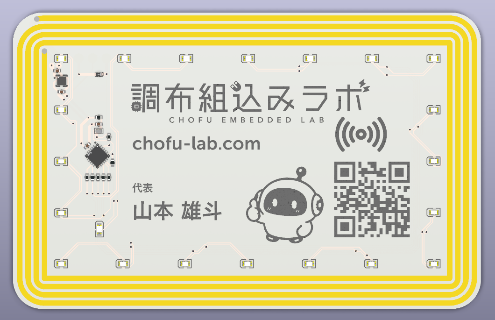
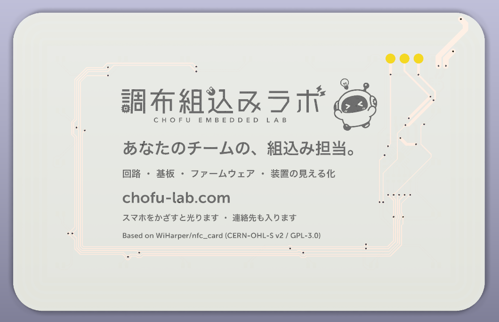

# nfc-card — スマホをかざすと光る NFC 基板名刺

<p align="center">
  
  
</p>

調布組込みラボの名刺用の基板です。電池はありません。スマホをかざすと、NFC の電波から取り出した電力でマイコンが起動し、外周の LED が光ります。

Wilson Harper さんの [WiHarper/nfc_card](https://github.com/WiHarper/nfc_card) をフォークし、シルク（ロゴ・文字・QR コード）を差し替え、JLCPCB で部品実装まで発注できるよう BOM を直したものです。回路・アンテナ・部品配置・配線は元の設計のままです。

*English summary is [below](#english).*

## 出典

- 元リポジトリ: [WiHarper/nfc_card](https://github.com/WiHarper/nfc_card)（commit `752793d`。このリポジトリはそのフォークで、元の履歴の上にこちらの変更を 1 コミットで載せています）
- 作者による解説: [wilsonharper.net/projects/businesscard](https://wilsonharper.net/projects/businesscard/)

回路・アンテナ・ファームウェアは元作者の設計です。公開してくださったことに感謝します。

## 状態

- 2026 年 9 月に JLCPCB へ 30 枚（部品実装込み）を発注済み。実機での動作確認はこれから
- 共振周波数の実測や iPhone / Android での読み取りの様子は、確認できしだい追記します

## 構成（元の設計と同じ）

| 項目 | 内容 |
|---|---|
| NFC | NXP NT3H2111W0FHKH（NTAG I2C plus 1k）。受け取った電力の余りを VOUT 端子から出せる |
| マイコン | Microchip ATtiny816（QFN20、1 MHz 動作） |
| LED | 赤 20 個（GPIO 5 本でチャーリープレクス駆動）＋ 電源表示の黄 1 個 |
| 電源 | VOUT から 2.2kΩ（R3）を通して 10µF（C3）をゆっくり充電し、起動から約 300 ms 後にマイコンが P-ch MOSFET（Q1）をオンにして R3 をバイパスする |
| アンテナ | 基板パターンの矩形スパイラル 4 ターン（外寸 84×53 mm、線幅 1 mm・間隔 0.5 mm）。元の作者の設計値は約 2.75µH で、1.5pF（C1）で調整 |
| 基板 | 2 層、厚さ 0.8 mm、85.45×54.08 mm（クレジットカードとほぼ同じ大きさ） |
| 書き込み | 裏面の UPDI パッド 3 点（GND / VCC / UPDI） |

## 元の設計からの主な変更

- **シルクの差し替え**: 表にロゴ・URL・名前・QR コード・キャラクター、裏にキャッチコピーと出典表記。元の設計の NFC アイコンと、アンテナの銅箔を見せるレジスト抜きは残しています。電源 LED 横の稲妻マークは、差し替えのときに意図せず消してしまいました（発注した基板にも入っていません）
- **文字はフォントの輪郭で描画**: KiCad の標準フォント（一筆書き）ではなく、フォントの輪郭を多角形にして配置（`scripts/text2json.py`）
- **C1 の部品番号を修正**: 元の設計では 0402 サイズのフットプリントに 0603 サイズの LCSC 番号（C1639）が入っており、JLCPCB の実装審査で指摘されました。同じシリーズの 0402 品（C1552、1.5pF C0G）に変更
- **R4 に LCSC 番号を追加**（C25076。元の設計では空欄）。C1・R4 とも、回路図・基板ファイル・BOM のすべてで直しています
- **ファームウェアのモールス信号を変更**: 電源 LED が起動の 10 秒後から点滅させる文字列を、元の作者のサイト名 "WILSONHARPER.NET" から "CHOFU-LAB.COM" に変更。それ以外の動作は元のまま
- **JLCPCB 用の製造データを追加**（`hardware/fab/`）
- **基板ファイルを KiCad 10 で保存**（`.kicad_pcb` は KiCad 9 では開けません。回路図は KiCad 9 形式のまま）

詳細は [`docs/CHANGES.md`](docs/CHANGES.md) にあります。

## ファイル構成

| パス | 内容 |
|---|---|
| `hardware/` | KiCad のプロジェクト（回路図・基板・部品ライブラリ）。基板は KiCad 10 形式 |
| `hardware/fab/` | 製造データ（ガーバー、JLCPCB 用 BOM・部品配置） |
| `software/` | ファームウェア `nfc_card.ino`（モールス信号の文字列だけ変更）と、アンテナを描く KiCad 用スクリプト `coil.py`（元の設計のまま） |
| `scripts/` | シルクを差し替えるスクリプト |
| `artwork/` | シルクの素材（ロゴ・キャラクター・文字の輪郭データ） |

## 製造（JLCPCB）

`hardware/fab/` の次の 3 つをアップロードします。

- `nfc-card-gerbers.zip`（ガーバー）
- `bom_jlcpcb.csv`（BOM）
- `positions_jlcpcb.csv`（部品配置）

KiCad が出力した BOM・部品配置ファイルは、そのままでは JLCPCB に読み込めなかったため、JLCPCB の書式に合わせたものを用意しています。

発注したときの設定:

- 2 層、厚さ 0.8 mm、30 枚
- 白レジスト・黒シルク、表面処理 ENIG
- 高精度シルク（High-precision Printing）。裏面の小さい文字が標準シルクの下限より細いため
- 部品実装: 標準（Standard PCBA）、表面のみ、捨て基板の除去あり

## 書き込み

元の設計と同じです。ATtiny816 には裏面のパッドから UPDI で書き込みます（クロックは 1 MHz）。NFC チップへの vCard や URL の書き込みには [NXP TagWriter](https://play.google.com/store/apps/details?id=com.nxp.nfc.tagwriter) を使います。元の作者によると、エネルギーハーベストは初期状態で有効です。

## シルクを作り直すとき

スクリプトは macOS 前提です（KiCad とフォントのパスが書き込んであります）。

1. 素材をシルク用の多角形データにする（Pillow と potrace が必要）。文言や画像を変えるときだけ必要で、生成済みのデータは `artwork/` に入っています
   - 文字: `python3 scripts/text2json.py`。フォントの既定はヒラギノ角ゴシック W6（macOS 同梱）と Museo Sans 700（別途インストールが必要）で、`--jp` / `--en` で差し替えられます
   - 画像: `python3 scripts/art2json.py ...`（オプションはスクリプト冒頭のコメント参照）
2. 元の設計の基板ファイルを取得し、KiCad 同梱の Python で `artwork.py` → `hide_refs.py` の順に実行する。リポジトリ内の基板ファイルは上書きされます

```bash
cd hardware
curl -L -o "Business Card v2.kicad_pcb" "https://raw.githubusercontent.com/WiHarper/nfc_card/752793dcc3164dadf245cb0bc9e7e368e9c0e78e/hardware/Business%20Card%20v2.kicad_pcb"
PY=/Applications/KiCad/KiCad.app/Contents/Frameworks/Python.framework/Versions/Current/bin/python3
$PY ../scripts/artwork.py
$PY ../scripts/hide_refs.py
```

`hide_refs.py` を別プロセスで実行するのは、KiCad 10.0.3 の Python API が、図形を大量に追加したあと同じプロセスで操作を続けると落ちることがあるためです。

作り直した基板ファイルでは、C1・R4 の LCSC 欄が元の設計の値に戻ります。KiCad の「回路図から基板を更新」で合わせるか、BOM は `hardware/fab/bom_jlcpcb.csv` を使ってください。ガーバーは KiCad の製造ファイル出力で作り、JLCPCB 用の CSV は `hardware/fab/` の既存ファイルと同じ列にそろえます。

## ライセンス

元の設計と同じライセンスです。この基板の設計データ一式の置き場所（CERN-OHL-S の Source Location）は、このリポジトリ https://github.com/chofu-lab/nfc-card です。

- `hardware/`・`artwork/`: [CERN-OHL-S v2](https://ohwr.org/cern_ohl_s_v2.txt)
- `software/`・`scripts/`: [GPL-3.0-or-later](https://www.gnu.org/licenses/gpl-3.0.html)

「調布組込みラボ」の名称・ロゴ・キャラクター「ちょふまる」は、標章としての利用を許諾していません。この設計をもとに名刺を作る場合は、ご自身のデザインに差し替えてください。詳しくは [`LICENSE.md`](LICENSE.md) を参照してください。

---

## English

A business-card PCB for Chofu Embedded Lab (Tokyo, Japan). It has no battery: when you hold a phone near it, the NFC chip harvests energy from the field, wakes up an ATtiny816, and the LEDs around the edge light up.

This is a fork of [WiHarper/nfc_card](https://github.com/WiHarper/nfc_card) by Wilson Harper. The circuit, antenna, placement, and routing are unchanged. What changed:

- New silkscreen artwork (logo, name, QR code, character), drawn from real font outlines instead of KiCad stroke fonts
- C1 LCSC part number fixed: the original BOM had C1639 (0603) on a 0402 footprint; replaced with C1552 (0402, 1.5 pF C0G)
- Added the missing LCSC number for R4 (C25076)
- The lightning mark next to the power LED was unintentionally removed during the silkscreen replacement (it is also missing on the boards we ordered)
- Firmware: the Morse code blinked by the power LED now spells "CHOFU-LAB.COM" instead of "WILSONHARPER.NET". Nothing else in the firmware is changed
- JLCPCB-ready fabrication files in `hardware/fab/`
- The board file is saved with KiCad 10 (it will not open in KiCad 9). The schematic is still in KiCad 9 format

Status: 30 boards were ordered from JLCPCB in September 2026, and they have not been tested yet. Measurements of the antenna resonance and phone behavior will be added later.

Source location of this design: https://github.com/chofu-lab/nfc-card

License: same as the original, CERN-OHL-S v2 for `hardware/` and `artwork/`, and GPL-3.0-or-later for `software/` and `scripts/`. The Chofu Embedded Lab name, logo, and character are not licensed for use as marks. Please replace them with your own artwork. See [`LICENSE.md`](LICENSE.md).
